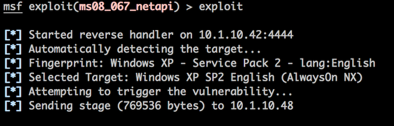

# Sesion 4 - Metasploit

## Recapitulación

* Primer hito sobre nuestro escenario

* Índice y objetivos claros sobre el trabajo grupal

* Instalación de la herramienta o leído sobre ella

* Estamos listos para comenzar con la interacción con los escenarios

* Dudas sobre como orientar los trabajos

## Noticia de la semana

`Hacker modified drinking water chemical levels in a US city`

* Utilizaban Mascan, introducido a través de una DLL
  * Más rapido porque implementa su propia pila TCP/IP
  * Introdujeron más dióxido de sodio
  * A través de Team Viewer
  * raidforums, foros para comprar accesos

## Metasploit

* Código abierto
* Modular
* Extensible
* Core (rex) desacoplado
* Existe Metasploit pro
* Algunos exploits de metasploit están mal a posta, rollo ponen paréntesis y no tira, porque tienes que ver el código y ver donde falla

* Dato curioso
  * Utilizar burner phones para ir a china

### Módulos

1. __Auxiliary__
  * Nunca van a generar una sesión
  * Conjunto de pruebas pero no genera una sesión para que interactúes

2. __Exploit__
   * Código que explota una vulnerabilidad

3. __Payloads__
  * Cada una de las piezas de código que quiero ejecutar de una determinada explotación
  * Me va a pemitir esa __interacción__

4. __Post__
  * Post-expotación, cuando puedo acceder

5. __Encoders__
  * Relacionados con la __evasión__
  * Evadir distintas medidas
  * Orientados a añadir distintas capas de complejidad para evadir los antivirus
  * Cifran los payloads o exploits

6. __Nops__
  * relacionados con la explotación

### Interfaces de Metasploit

* msfconsole (Console)
* Armitage (Interfaz GUI)
* metasploit PRO (Versión comercial)
* Kage (Otra GUI)

### Integración con nmap

* Podemos usar __db_nmap__
  * `msf > db_nmap -Pn -sTV -T4 --open --min-parallelism 64 --version-all 192.168.216.10 -p –`

* Nmap con metasploit

* El descubrimiento de vulnerabilidades se parece a una base de datos de metasploit
  * Ver máquina __optimum__ de HTB

### Análisis de vulnerabilidades con metasploit

* Integración con:
  * Nessus
  * OPenVas
  * Nexpose
* Los resultados podrán cargarse de vuelta en la base de datos __vulns__ de metsploity accede a ellos más adelante

### Identificación de exploits

* arch: Buscar por aquitectura
* cve: Buscar por CVE
* edb: Buscar por Exploit-DB ID
* check: Módulos que soportan el método Check
* description: Buscar por descripción
* platform: Buscar por plataforma
* type: Buscar por tipo (exploit, payload, auxiliary, encoder, evasion, post o nop)

### Búsqueda de exploits

* `search arch:86 type:exploit cve:2020`

* `search platform:linux type:exploit cve:2020`

* `msfupdate` no existe ya

Para zerologon:
* `$ apt update; apt install metasploit-framework`
* `$ apt install ruby2.7 ruby2.7-dev`
* `$ cd /usr/share/metasploit-framework`
* `$ bundle install`

## Ejemplo explotación básica

* `exploit -j` buscar

* `bind shell` cnexión de cliente a servidor
* `reverse shell` conexión de servidor a cliente

## Ejecución manual

1. `searchsploit <HFS>`
2. `searchsploit -m <num_exploit-db>`

## Sesiones

Nos permite acceder al conjunto de funcionalidades que permite abrir una shell remota

Cuál es el código que se ejecuta en la máquina destino

Interactuamos mediante sesiones

* Información detallada sobre las sesiones
  * `sessiones -v`

* Listado de sesiones
  * `sessions -l`

* Convertir una sesión a meterpreter
  * `sessions -u id_session`

* Interactuar con una sesión
  * `sessions -i id_sesion`

* Para mandar a segundo plano una sesión de meterpreter podemos usar __background__

3 tipos de payloads en metasploit:
1. __Single__
2. __Staged__ el nombre la explotación requiere de varios pasos, que no realizamos nosotros si no las funcionalidades de metasploit, se consigue una en el sistema remoto
   1. `windows/shell/reverse_tcp` 
3. __Stageless__
   1. Parece lo mismo, la diferencia es la funcionalidad empotrada en un ejecutable, no hace falta ninguna DLL de más, 
   2. `windows/shell_reverse_tcp`

Si yo me quiero abrir una shell con la funcionalidad de una reverse tcp y que tenga como objetivo Windows, 

[Staged vs stageless payloads](https://blog.rapid7.com/2015/03/25/stageless-meterpreter-payloads/)

## Staged payload

Tipo común que se establece entre el sistema y el sistema remoto

Modulariza las partes, porque:
* Pasa el conjunto de DLLs, estas DLLs añaden la funcionalidad que nosotros queremos

__Staged payload__: Es un payload lo más compacto posible, provee los medios para que un atacante puede subir algo más grande.

El shellcode inicial (_stage0_) crea una nueva conexión a la máquina atacante y lee un payload más largo en memoria. Cuando el payload se ha recibido, Stage0 oas el control al nuevo payoad.

Este payload es conocido como __reverse_tcp__ y después el _stage1_ puede ser una shell normal o algo más complejo como una sesión VNC. Existen opciones _staged_ como __reverse_https__ y __bind_tcp__ que ofrece diferentes opciones para abrir una puerta paro el __stage1__.

__set PAYLOAD windows/meterpreter/..__ Prepara un payload en 2 _stages_, la segunda nos da una sesión de Meterpreter.

#### Ejemplo staged con máquina vulnerable a SMB

Ejemplo de cómo utilizando Metasploit con el exploit __ms08_067_netapi__ configurado para utilizar un payload Meterpreter staged que tiene __stage0__ establecido en __reverse_tcp__ utilizando el puerto 4444. El segundo es una instancia de Windows que ejecuta una implementación vulnerable de SMB escuchando en el puerto 445.

Cuando se ejecuta el payload, Metasploit crea un __listener__ en el puerto correcto, y luego establece una conexión con el servicio SMB destino.

Cuando el servicio SMB destino recibe la conexión, se invoca una función que contiene un overflow que la máquina atacante desbordará.

La máquina atacante envía datos más grandes de los esperados, que son_stage0_ contienen código específico del exploit.

El exploit permite ganar control sobre el EIP y redirigir el proceso hacia el shellcode _stage0_.

El atacante tiene control sobre el servicio SMB. Cuando el _stage0_ (__reverse_tcp__) se ejecuta se conecta con el atacante, que está preparado y esperando el _stage1_. En este caso _stage1_ es __metsrv__.

Ahora se envía la DLL __metsrv__ a la máquina de destino a través de esta conexión inversa. Esto es lo que ocurre cuando vemos el mensaje "_Sending stage .._" en msfconsole.

Una vez se ha enviado, el shellcode _stage0_ lo escribe en memoria. Una vez _stage1_ está en memoria, _stage0_ pasa el control a la dirección donde se almacenó el _stage1_ 

En el caso de __metsrv__, los primeros 60 bytes son una colección de shellcodes que se parece a una cabecera válida de DOS. Este shellcode, cuando se ejecuta, utiliza la Reflective DLL Injection para reasignar y cargar __metsrv__ en la memoria de tal manera que le permite funcionar correctamente como una DLL normal sin escribirla en el disco o registrarla con el proceso. Luego invoca __DllMain()__ en esta DLL cargada, y el Meterpreter toma el control.

A partir de aquí, MSF carga dos DLLs de extensión de Meterpreter: __stdapi__ y __priv__. Ambas se cargan de forma reflexiva de la misma manera que la DLL original de metsrv. En este punto, Meterpreter está listo y dispuesto a recibir sus comandos.

Para conseguir que una sesión de Meterpreter se ejecute en el escenario de ejemplo hemos cargado lo siguiente:

* _stage0_: Búffer de  aproximadamente 350bytes de shellcode.
* _stage1_: __metsrv__ DLL aproximadamente 755kb.
* _stage2_: __stdapi__ DLL aproximadamente 370kb.
* _stage3_: __priv__ DLL aproximadamente 115kb.

Esto pesa un total de aproximadamente 1.240 kb. No es una cantidad pequeña para aquellos que no están en la red local.

El ejemplo más común en el que esto falla es en los pentesting con bajo ancho de banda o alta latencia 

El coste de datos o de tiempo de cargar metsrv, stdapi y priv para cada shell se vuelve muy grande.

En este escenario, es mejor tener la capacidad de crear un _stage0_ que incluya __metsrv__ y cualquier número de extensiones de Meterpreter. Esto significa que el payload ya incluye la parte importante de la funcionalidad de Meterpreter, junto con todas las características que el atacante podría requerir. Cuando se invoca, la instancia de Meterpreter ya tiene todo lo que necesita para funcionar, y por lo tanto Metasploit no necesita perder tiempo

Stageless Meterpreter es eso, un binario que incluye todas las partes de Meterpreter, junto con cualquier extensión, todo agrupado en uno.

## ¿A qué se parece Meterpreter stageless?

Desaparece directamente el _stage0_.

El _stage1_ en meterpreter staged viene a ser bootstrapper para el payload en meterpreter stageless

No necesitan ninguna descarga adicional

* Generamos el payload utilizando __msfvenom__

* Creamos __listener__ / __handlers__ en local (multi/handler())
* Desplegamos el payload
* Esperamos a recibir la sesión

### Meterpreter

* __Meterpreter__ es el payload más famoso de Metasploit, trabaja dentro del __context__.

* Es famoso por su migración hacia otros procesos, por si alguien cierra el ejecutable que no se corte la conexión, para que tenga persistencia

* Es __fileless__: no existen artefactos que residan en el disco del ordenador

* Son Extensibles

Otros ejemplos:

* pupy rat
* covenant
* empire github
* cobalt strike
  * malleable profile
  * Necesitas un c&c, le dices qué quieres que haga y pasar qué cosas, metasploit es un canal cifrado
  * Cobalt pregunta por un protocolo de transporte, protocolo de comunicacion del C&C, https o http y DNS
  * Por otro lado pregunta a qué quieres que se parezca, como se camuflan la peticiones (endpoints)
  * Muy famoso el malleable profile de Jquery 
  * Primer profile de cobal q vio enrique es de amazon, búsquedas camufladass
